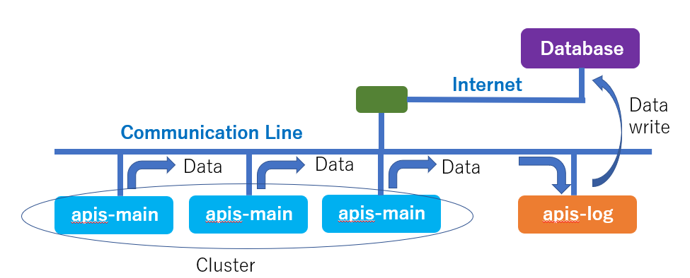
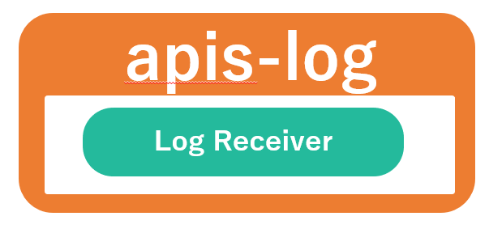
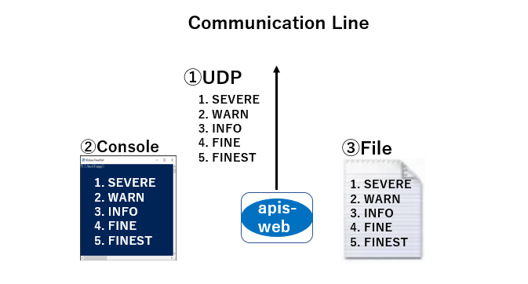

**apis-log Specification**
=====
**Rev 0.54**

# **Contents**
- [**apis-log Specification**](#apis-log-specification)
- [**Contents**](#contents)
- [**1. Terms and Abbreviations**](#1-terms-and-abbreviations)
- [**2. Overview**](#2-overview)
- [**3. Software Composition**](#3-software-composition)
  - [**3.1. Software Architecture**](#31-software-architecture)
  - [**3.2. Software Composition**](#32-software-composition)
- [**4. Detailed Description of Actions**](#4-detailed-description-of-actions)
  - [**4.1. Log Receiver**](#41-log-receiver)
- [**5. Data Written to MongoDB**](#5-data-written-to-mongodb)
  - [**5.1. Data Written to Log Receiver MongoDB**](#51-data-written-to-log-receiver-mongodb)
- [**6. Configuration Files**](#6-configuration-files)
  - [**6.1. config.json**](#61-configjson)
  - [**6.2. logging.properties**](#62-loggingproperties)
  - [**6.3. start.sh**](#63-startsh)
  - [**6.4. stop-kill.sh**](#64-stop-killsh)
- [**7. Logging Functions**](#7-logging-functions)
  - [**7.1. Log Level**](#71-log-level)
  - [**7.2. Log Output Destinations**](#72-log-output-destinations)
- [**8. Error Handling**](#8-error-handling)
- [**9. Security**](#9-security)
  - [**9.1. Inter-APIS Communication Security**](#91-inter-apis-communication-security)
- [**10. Privacy**](#10-privacy)
- [**11. Open-Source Software Licenses**](#11-open-source-software-licenses)
- [**12. Operating Environment**](#12-operating-environment)
  - [**12.1. Recommended Hardware Specifications**](#121-recommended-hardware-specifications)
  - [**12.2. Recommended Operating System Specifications**](#122-recommended-operating-system-specifications)

# **1. Terms and Abbreviations**

| **Term**  | **Explanation**                                                                                                                                                         |
| --------- | ----------------------------------------------------------------------------------------------------------------------------------------------------------------------- |
| apis-main | Software for energy sharing developed by Sony CSL that enables autonomous decentralized control. (For more information, refer to the apis-main Specification Document.) |
| Vert.x    | A framework for implementing load-balancing programs. Using Hazelcast, the event bus is clustered and load-balanced.                                                    |

 

# **2. Overview**

apis-log is software for receiving data from apis-main by multicast via a communication line and storing that information in a database in JSON format.

  
Figure 2-1  

 

# **3. Software Composition**

## **3.1. Software Architecture**

The apis-log software architecture is illustrated in Figure 3-1. apis-log runs on the Vert.x event-driven load distribution platform, which runs on top of the Java Development Kit (JDK) on Linux. (Operation has been confirmed on the OSS software version 11. Refer to the OSS license.)

  
Figure 3-1  

 

## **3.2. Software Composition**

The service provided by apis-log is described below.

* Log Receiver  
 This service receives data from apis-main by UDP multicast via the communication line and stores that information in a MongoDB database in JSON format.

  
Figure 3-2

 

# **4. Detailed Description of Actions**
    
## **4.1. Log Receiver**

This service receives data from apis-main by UDP multicast via the communication line, extracts the required data from UDP1 packets, and then stores that information in a MongoDB database in JSON format. Data written to the database can be encrypted with SSL. (See section 5.1, “Data Written to Log Receiver MongoDB.)

  
Figure 4-1  

 

# **5. Data Written to MongoDB**
    
## **5.1. Data Written to Log Receiver MongoDB**

The data that is written to the MongoDB database is described below.

<table>
<tbody>
<tr class="even">
<td>address</td>
<td>IP Address of the log source</td>
</tr>
<tr class="odd">
<td>unitname</td>
<td>Name of the log source</td>
</tr>
<tr class="even">
<td>thread</td>
<td>
Thread name of the log source

&lt; Examples &gt;

“vert.x-eventloop-thread-X”

“vert.x-worker-thread-X”
</td>
</tr>
<tr class="odd">
<td>datetime</td>
<td>Date and time the log was sent</td>
</tr>
<tr class="even">
<td>loglevel</td>
<td>
The log level

&lt; E.g.: “SEVERE”, “WARNING”, “INFO”, ”FINE”, “FINEST”&gt;
</td>
</tr>
<tr class="odd">
<td>loggername</td>
<td>
Name of the program that output the log

&lt; Examples &gt;

“jp.co.sony.csl.dcoes.apis.main.app.controller.DataAcquisition”

“jp.co.sony.csl.dcoes.apis.main.app.gridmaster.DataCollection”

“jp.co.sony.csl.dcoes.apis.main.app.gridmaster.main_loop.DealExecution”

“jp.co.sony.csl.dcoes.apis.main.app.user.ErrorCollection”

“com.hazelcast.partition.InternalPartitionService”
</td>
</tr>
<tr class="even">
<td>message</td>
<td>
The log message

&lt; Examples &gt;

“(HARDWARE:LOCAL:ERROR:E032) dcdc mode : CHARGE ; invalid dcdc.meter.ig value : 0.0 ;should between 1.875 and 2.125”

“(FRAMEWORK:LOCAL:ERROR:E023)com.hazelcast.core.

OperationTimeoutException: No response for 120000 ms.”

</td>
</tr>
</tbody>
</table>

 

# **6. Configuration Files**

The various configuration files used by apis-log are described below.

## **6.1. config.json**

The following basic information for configuring apis-log is set in a JSON-format file. The file is read once when the program starts up, so if a parameter is changed, apis-log must be restarted.

<table>
<tbody>
<tr class="even">
<td>programId</td>
<td>Program identification string</td>
</tr>
<tr class="odd">
<td>comminityId</td>
<td>Community identification string; higher-level ID when organizing more than one cluster</td>
</tr>
<tr class="even">
<td>clusterId</td>
<td>Cluster identification string; used as encryption seed, together with comminityId and the apis-main version string</td>
</tr>
<tr class="odd">
<td>logReceiver.ipv6</td>
<td>
A flag that indicates whether IPv6 is enabled or disabled

&emsp;Enabled: True

&emsp;Disabled: False
</td>
</tr>
<tr class="even">
<td>
log.Receiver.multicast

GroupAddress
</td>
<td>An IP Address that specifies a particular group for multicasting</td>
</tr>
<tr class="odd">
<td>log.Receiver.port</td>
<td>
Log Receiver port number (port = 8888)

When there are two clusters on a communication line, they are given different port numbers specified by log.Receiver.port.
</td>
</tr>
<tr class="even">
<td>log.Receiver.printToStdout</td>
<td>
A flag that indicates whether Log Receiver Log Console output is enabled or disabled

&emsp;Enabled: True

&emsp;Disabled: False
</td>
</tr>
<tr class="odd">
<td>mongoDbWriter.enabled</td>
<td>
A flag that indicates whether writing to MongoDB is enabled or disabled.

&emsp;Enabled: True

&emsp;Disabled: False
</td>
</tr>
<tr class="even">
<td>mongoDbWriter.level</td>
<td>
Log level for writing to the MongoDB database

(Logs of Log Level or higher are written to the database.)
</td>
</tr>
<tr class="odd">
<td>mongoDbWriter.host</td>
<td>The MongoDB IP address</td>
</tr>
<tr class="even">
<td>mongoDbWriter.port</td>
<td>The MongoDB port number</td>
</tr>
<tr class="odd">
<td>mongoDbWriter.ssl</td>
<td>
A flag that indicates whether SSL is enabled or disabled for MongoDB communication.

&emsp;Enabled: True

&emsp;Disabled: False
</td>
</tr>
<tr class="even">
<td>mongoDb.database</td>
<td>The name of the “database” data structure for writing to the MongoDB database.</td>
</tr>
<tr class="odd">
<td>mongoDb.collection</td>
<td>The name of the “collection” data structure for writing to the MongoDB database.</td>
</tr>
<tr class="even">
<td>watchdog.enabled</td>
<td>A flag that indicates whether Watch Dog is enabled or disabled.</td>
</tr>
<tr class="odd">
<td>watchdog.periodMsec</td>
<td>The watchdog reset period (ms)</td>
</tr>
<tr class="even">
<td>watchdog.host</td>
<td>The IP address accessed by the watchdog service at the interval specified by periodMsec</td>
</tr>
<tr class="odd">
<td>watchdog.port</td>
<td>The port number accessed by the watchdog service at the interval specified by periodMsec</td>
</tr>
<tr class="even">
<td>watchdog.uri</td>
<td>The watchdog service URI</td>
</tr>
<tr class="odd">
<td>
watchdog.request

TimeoutMsec
</td>
<td>The timeout time of the watchdog service (ms)</td>
</tr>
</tbody>
</table>

 

## **6.2. logging.properties**

This file contains settings that are related to log output of the standard java.util.logging API (log file location, log capacity, logging level, etc.).

 

## **6.3. start.sh**

This shell script is executed automatically to start up apis-log when the OS boots up.  

The command in start.sh that starts up apis-log is shown below.

 

> java -Djava.net.preferIPv4Stack=true -Duser.timezone=Asia/Tokyo -Djava.util.logging.config.file=./logging.properties -jar ./apis-log-2.23.0-a01-fat.jar -conf ./config.json -cp ./ -cluster &

 
The arguments that follow ‘java’ in the command are explained below.

* Djava.net.preferIPv4Stack=true  
 \-\> Option for binding to an IPv4 address

* Duser.timezone=Asia/Tokyo  
 \-\> Time zone setting

* Djava.util.logging.config.file=./logging.properties  
 \-\> Option for specifying the log configuration file

* jar ./apis-log-2.23.0-a01-fat.jar  
 \-\> Option for specifying execution of the program encapsulated in a JAR file

* conf ./config.json  
 \-\> Option for specifying the configuration file

* cp ./  
 \-\> Option for specifying the location of the cluster.xml file

 

## **6.4. stop-kill.sh**

This file holds a shell script that stops execution of the apis-log process.

After executing the shutdown function (stop) via the event bus, the script forcefully terminates its own Java process when a timeout occurs. The timeout time can be set in units of seconds within the script.

 

# **7. Logging Functions**
    
## **7.1. Log Level**

The standard Java java.util.logging API is used for logging. Of the seven available log levels described below, the “CONFIG” and “FINER” levels are not used for APIS. The APIS operation logs are described in the logging.properties file, where the log file location, log levels, maximum log size, and maximum number of logs are set.

\[java.util.logging Log Level\]

1.  SEVERE
 *  This level is used when an execution error occurs  
   Log output at this level can be considered an indication that a problem has occurred. 
      * \< Example \>  
        * Analysis of a log received by UDP fails.

2.  WARNING
 *  This level is used to issue a warning when there is unexpected behavior that is not an execution error.   
   Although this level is available in APIS, it is not used for apis-log.

3.  INFO  
 *  This level is used to output information during normal execution. For apis-log, it is used when event processing that is particularly important to operation is performed.  
    *  \< Example \> 
       *  Connection information for MongoDB

4.  CONFIG  
 *   This level relates to configuration settings, but is not output for apis-log.

5.  FINE  
 *  This level is used for output of ordinary operation information during normal system operation, but it is not output for apis-log.

6.  FINER  
 *  This level is for information related to the starting and stopping of specific processes, but is not output for apis-ccc.

7. FINEST  
 * This level is used for output of ordinary operation information during normal system operation.
   * \< Example \>
     * When Vert.x Verticle is started up, etc.

 

## **7.2. Log Output Destinations**

The apis-log operation logs are output to three destinations: UDP, console, and file. The log output destination and output level can be set in the logging.properties file. Since UDP is output to the communication line, communication traffic and the risk of data leakage should be considered when setting the UDP. In addition, the capacity of non-volatile storage should be considered when outputting to a file.

 

# **8. Error Handling**

When a problem occurs, the log is output to file, UDP, and console, but there is no function for the process to reset or stop itself.

 

# **9. Security**
    
## **9.1. Inter-APIS Communication Security**

Communication between apis-log and MongoDB is SSL-encrypted, with the public or signed certificate provided by MongoDB.

* Communication between apis-log and MongoDB  
  * SSL public-key cryptography (RSA)
  * SSL self-signed certificate

 

# **10. Privacy**

It is necessary to check whether or not the information that can be obtained via apis-log is personal information, because what is considered to be personal information varies with the region of introduction. Caution is required, because the act of sending personal information to an external server without the permission of the information owner may be subject to personal information protection regulations such as GDPR.

 

# **11. Open-Source Software Licenses**

The software used by apis-log and the relevant open-source software licensing information is listed in the table below. Because Adopt OpenJDK is used by apis-log only as a linked library, it is not necessary to open the apis-ccc source code, even under GPL v2 with Classpath Exception applied. For the other software, also, no license requires the apis-log source code to be published.

■ Open-source software licensing of software used by apis-log

<table>
<thead>
<tr class="header">
<th>Software</th>
<th>Version</th>
<th>License</th>
<th>Code Change</th>
</tr>
</thead>
<tbody>
<tr class="odd">
<td>Adopt OpenJDK</td>
<td>11.0.4+11</td>
<td>GPLv2 with Classpath Exception</td>
<td>None</td>
</tr>
<tr class="even">
<td>Vert.x</td>
<td>3.7.1</td>
<td>
Dual license (select from the following)

Eclipse Public License 2.0

Apache License 2.0
</td>
<td>None</td>
</tr>
<tr class="odd">
<td>Netty</td>
<td>4.1.8</td>
<td>Apache License 2.0</td>
<td>None</td>
</tr>
<tr class="even">
<td>FasterXML/Jackson</td>
<td>2.7.4</td>
<td>Apache License 2.0</td>
<td>None</td>
</tr>
</tbody>
</table>

\*Software versions may change for various reasons.

 

# **12. Operating Environment**
    
## **12.1. Recommended Hardware Specifications**

The hardware requirements for apis-log are described below.

<table>
<tbody>
<tr class="even">
<td>CPU processor</td>
<td>
600 to 1000 MHz, 64 bit single-core, 32 KB L1 cache or more

ARMv8 recommended 
(If a CPU other than ARMv8 is used, it is necessary to confirm APIS operation.)
</td>
</tr>
<tr class="odd">
<td>DRAM</td>
<td>DDR3, 1.6 Gbps, 1 GB or more</td>
</tr>
<tr class="even">
<td>Internal storage</td>
<td>8 GB or more</td>
</tr>
<tr class="odd">
<td>Ethernet</td>
<td>20 Mbps, 1 port or more, IPv4 and IPv6 support</td>
</tr>
</tbody>
</table>

 

## **12.2. Recommended Operating System Specifications**

The OS requirements for IoT boards used with apis-log use are described below.

<table>
<tbody>
<tr class="even">
<td>Type</td>
<td>64-bit OS, Linux recommended(If an OS other than Linux is used, it is necessary to confirm APIS operation.)</td>
</tr>
<tr class="odd">
<td>Size</td>
<td>Depends on the capacity of the IoT Board 
(3 GB reserved for storing APIS logs, etc.)</td>
</tr>
<tr class="even">
<td>Operating software</td>
<td>AdoptOpenJDK (32/64bit)</td>
</tr>
<tr class="odd">
<td>OSS licensing</td>
<td>To avoid the effects of copyleft licenses such as GPL, it is prohibited to use an OS that run software covered by such licenses together with apis-log as a single executable file (RTOS, etc.).</td>
</tr>
<tr class="even">
<td rowspan="5">Other</td>
<td>It shall be possible to run apis-ccc automatically when the OS boots.</td>
</tr>
<tr class="odd">
<td>ssh login/scp file transfer shall be possible.</td>
</tr>
<tr class="even">
<td>Logs can be periodically renamed, compressed, or deleted with logrotage, etc.</td>
</tr>
<tr class="odd">
<td>A fixed IPv4 address shall be possible.</td>
</tr>
<tr class="even">
<td>Time synchronization with an ntp server shall be possible.</td>
</tr>
</tbody>
</table>

 
