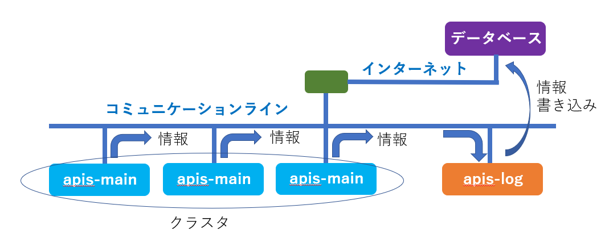
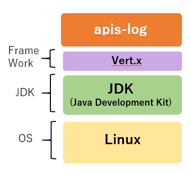
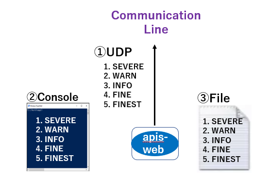

**apis-log Specification**
=====
**Rev 0.54**

# **目次**
- [**apis-log Specification**](#apis-log-specification)
- [**目次**](#目次)
- [**1. 用語・略語**](#1-用語略語)
- [**2. 概要**](#2-概要)
- [**3. ソフトウェア構成**](#3-ソフトウェア構成)
  - [**3.1. ソフトウェアアーキテクチャ**](#31-ソフトウェアアーキテクチャ)
  - [**3.2. ソフトウェア構成**](#32-ソフトウェア構成)
- [**4. 機能説明**](#4-機能説明)
  - [**4.1. Log Receiver**](#41-log-receiver)
- [**5. MongoDB書き込み情報**](#5-mongodb書き込み情報)
  - [**5.1. Log Receiver MongoDB書き込み情報**](#51-log-receiver-mongodb書き込み情報)
- [**6. 設定ファイルについて**](#6-設定ファイルについて)
  - [**6.1. config.json**](#61-configjson)
  - [**6.2. logging.properties**](#62-loggingproperties)
  - [**6.3. start.sh**](#63-startsh)
  - [**6.4. stop-kill.sh**](#64-stop-killsh)
- [**7. Log出力**](#7-log出力)
  - [**7.1. Log Level**](#71-log-level)
  - [**7.2. . APIS動作Log出力先**](#72--apis動作log出力先)
- [**8. 異常処理**](#8-異常処理)
- [**9. セキュリティ**](#9-セキュリティ)
  - [**9.1. APIS間通信セキュリティ**](#91-apis間通信セキュリティ)
- [**10. プライバシー**](#10-プライバシー)
- [**11. OSSライセンス**](#11-ossライセンス)
- [**12. 動作環境**](#12-動作環境)
  - [**12.1. ハードウェア要求**](#121-ハードウェア要求)
  - [**12.2. OS要求**](#122-os要求)

# **1. 用語・略語**

| **用語**    | **説明**                                                                  |
| --------- | ----------------------------------------------------------------------- |
| apis-main | 自律分散制御を可能にするSony CSLが開発した電力相互融通ソフトウェアである。(詳細はapis-main仕様書を参照。)          |
| Vert.x    | 負荷分散プログラムのフレームワーク。Hazelcastライブラリを利用してEvent Busをクラスタ化しネットワーク上で負荷分散処理を行う。 |

 

# **2. 概要**

apis-logはapis-main等がコミュニケーションラインにマルチキャストで出力する情報を受信しJSON形式に整えた上でデータベースに書き込みを行うソフトウェアである。

  
図2-1

 

# **3. ソフトウェア構成**

## **3.1. ソフトウェアアーキテクチャ**

図3-1はapis-logのソフトウェアアーキテクチャを示した図である。Linux OS上にJDK(Java Development Kit)、その上にイベントドリブンの負荷分散プラットフォームであるVert.xのフレームワークを使用してapis-logを動作させている。 (動作確認済みOSSソフトウェアのVersionは11. OSSライセンス参照)

  
図3-1  

 

## **3.2. ソフトウェア構成**

apis-logは以下のServiceを提供する。

* Log Receiver  
  コミュニケーションライン上にUDPでマルチキャストされるapis-main等のLogを受信し、JSON形式に整えた上でMongoDBに保存するServiceである。

図3-2

 

# **4. 機能説明**
    
## **4.1. Log Receiver**

apis-logのServiceであるLog Receiverはapis-main等がUDPでマルチキャスト出力するLogを受信し、UDP 1パケットから必要な情報を抜き出した後にJSON形式に整えて随時 MongoDB宛てに書き込みを行うServiceである。MongoDB への書き込みはSSLで暗号化することが可能である。(MongoDBへの書き込み情報に関しては 5.1 Log Receiver MongoDB書き込み情報参照)

  
図4-1  

 

# **5. MongoDB書き込み情報**
    
## **5.1. Log Receiver MongoDB書き込み情報**

MongoDBへの書き込み情報は以下である。

<table>
<tbody>
<tr class="even">
<td>address</td>
<td>Log送信元IP Address</td>
</tr>
<tr class="odd">
<td>unitname</td>
<td>Log送信元名称</td>
</tr>
<tr class="even">
<td>thread</td>
<td>
Log送信元Thread名称

&lt;例&gt;

“vert.x-eventloop-thread-X”

“vert.x-worker-thread-X”
</td>
</tr>
<tr class="odd">
<td>datetime</td>
<td>Log送信時間</td>
</tr>
<tr class="even">
<td>loglevel</td>
<td>
Log Level

&lt;例 : “SEVERE”, “WARNING”, “INFO”, ”FINE”, “FINEST”&gt;
</td>
</tr>
<tr class="odd">
<td>loggername</td>
<td>
Log出力プログラム名称

&lt;例&gt;

“jp.co.sony.csl.dcoes.apis.main.app.controller.DataAcquisition”

“jp.co.sony.csl.dcoes.apis.main.app.gridmaster.DataCollection”

“jp.co.sony.csl.dcoes.apis.main.app.gridmaster.main_loop.DealExecution”

“jp.co.sony.csl.dcoes.apis.main.app.user.ErrorCollection”

“com.hazelcast.partition.InternalPartitionService”
</td>
</tr>
<tr class="even">
<td>message</td>
<td>
Log Message

&lt;例&gt;

“(HARDWARE:LOCAL:ERROR:E032) dcdc mode : CHARGE ; invalid dcdc.meter.ig value : 0.0 ;should between 1.875 and 2.125”

“(FRAMEWORK:LOCAL:ERROR:E023)com.hazelcast.core.

OperationTimeoutException: No response for 120000 ms.”

</td>
</tr>
</tbody>
</table>

 

# **6. 設定ファイルについて**

apis-logには複数の設定ファイルが存在する。それらのファイルについて説明する。

## **6.1. config.json**

json形式のファイルでapis-logの基本情報を設定する。起動時に一度だけ読み込まれるためパラメータを変更した場合はapis-logの再起動が必要となる。

<table>
<tbody>
<tr class="even">
<td>programId</td>
<td>プログラム識別文字列</td>
</tr>
<tr class="odd">
<td>comminityId</td>
<td>コミュニティ識別文字列で1つ以上のクラスタをまとめる上位概念のID。</td>
</tr>
<tr class="even">
<td>clusterId</td>
<td>クラスタ識別文字列</td>
</tr>
<tr class="odd">
<td>logReceiver.ipv6</td>
<td>
IPv6 有効/無効 設定

&emsp;有効 : true

&emsp;無効 : false
</td>
</tr>
<tr class="even">
<td>
log.Receiver.multicast

GroupAddress
</td>
<td>IP Addressの特定のグループを指定するマルチキャストAddress</td>
</tr>
<tr class="odd">
<td>log.Receiver.port</td>
<td>
Log Receiver用 Port番号 Port = 8888

コミュニケーションラインに2つのクラスタが存在する場合はlog.Receiver.portのPort番号を分けることで対応する。
</td>
</tr>
<tr class="even">
<td>log.Receiver.printToStdout</td>
<td>
Log Receiver Log Console出力 有効/無効 設定

&emsp;有効 : true

&emsp;無効 : false
</td>
</tr>
<tr class="odd">
<td>mongoDbWriter.enabled</td>
<td>
MongoDB書き込み 有効/無効 設定

&emsp;有効 : true

&emsp;無効 : false
</td>
</tr>
<tr class="even">
<td>mongoDbWriter.level</td>
<td>
MongoDB書き込みLog Level

(設定されたLog Level以上のLogをMongoDBへ書き込む)
</td>
</tr>
<tr class="odd">
<td>mongoDbWriter.host</td>
<td>MongoDB 用IP Address</td>
</tr>
<tr class="even">
<td>mongoDbWriter.port</td>
<td>MongoDB 用Port番号</td>
</tr>
<tr class="odd">
<td>mongoDbWriter.ssl</td>
<td>
MongoDB間通信SSL有効/無効

&emsp;有効 : true

&emsp;無効 : false
</td>
</tr>
<tr class="even">
<td>mongoDb.database</td>
<td>MongoDBへ書き込む際のData構造の ”database” 名称</td>
</tr>
<tr class="odd">
<td>mongoDb.collection</td>
<td>MongoDBへ書き込む際のData構造の ”collection” 名称</td>
</tr>
<tr class="even">
<td>watchdog.enabled</td>
<td>Watch Dog 有効/無効 設定</td>
</tr>
<tr class="odd">
<td>watchdog.periodMsec</td>
<td>Watch Dog Reset周期　(ms)</td>
</tr>
<tr class="even">
<td>watchdog.host</td>
<td>Watch DogがperiodMsec間隔でAccessするIP Address</td>
</tr>
<tr class="odd">
<td>watchdog.port</td>
<td>Watch Dog がperiodMsec間隔でAccessするPort番号</td>
</tr>
<tr class="even">
<td>watchdog.uri</td>
<td>Watch DogサービスのURI</td>
</tr>
<tr class="odd">
<td>
watchdog.request

TimeoutMsec
</td>
<td>Watch DogのTimeout時間(ms)</td>
</tr>
</tbody>
</table>

 

## **6.2. logging.properties**

Javaの標準APIであるjava.util.loggingのLogの出力に関する設定(Logファイルの保存先、Log の保存容量、Log Levelの設定等)が記述されているファイル。

 

## **6.3. start.sh**

apis-logを起動させるスクリプトファイル。OS起動時の自動実行で実行される。

以下にstart.sh内でのapis-logを起動させるコマンドを示す。

 

> java -Djava.net.preferIPv4Stack=true -Duser.timezone=Asia/Tokyo -Djava.util.logging.config.file=./logging.properties -jar ./apis-log-2.23.0-a01-fat.jar -conf ./config.json -cp ./ -cluster &

 

“java”の後の引き数の意味を以下に説明する。

* Djava.net.preferIPv4Stack=true  
 \-\>IPv4アドレスにバインドして起動するオプション。

* Duser.timezone=Asia/Tokyo  
 \-\> Timezone設定。

* Djava.util.logging.config.file=./logging.properties  
 \-\>Log構成ファイルを指定するオプション。

* jar ./apis-log-2.23.0-a01-fat.jar  
 \-\>JARファイルの中にカプセル化されたプログラムの実行を指定するオプション。

* conf ./config.json  
 \-\>構成ファイルを指定するオプション。

* cp ./  
 \-\>cluseter.xmlファイルの位置を指定するオプション。

 

## **6.4. stop-kill.sh**

apis-logを停止させるスクリプトファイル。  
Event Bus経由のShutdown機能(stop)を実施した後、それがタイムアウトした場合に自身のJavaプロセスを強制終了させる処理を行う。スクリプトの中でタイムアウトを秒で指定することが可能である。

 

# **7. Log出力**
    
## **7.1. Log Level**

Log出力にはJava標準APIのjava.util.loggingを使っており以下の7つのLevelに分類されている。APISとしては”CONFIG”, “FINER”のLevelは使用しない。これらのAPISの動作Logはlogging.propertiesファイルに記載することでLogファイルの保存先、保存するLog Level、最大Logサイズ、最大保存Log数等の設定を行っている。

\[java.util.logging Log Level\]

1. SEVERE  
 * 実行中にErrorが発生した場合に使われるLevelである。  
  このLevelのLogが出力された場合には何等かの不具合が発生したと考えられる。  
    * \<例\> UDP受信したLogの解析が失敗した場合

2. WARNING  
 * 実行中にErrorではないが期待された動作でないため警告として知らせる目的で使われるLevelであるがapis-logとしてはこのLevelの出力は行わない。

3. INFO  
 * 実行中の正常系の情報を出力する際に用いられるLevelで、apis-logでは特に動作として重要なイベント処理を行った際に使われる。
   * \<例\> MongoDBとの接続情報

4. CONFIG  
 * 設定に関するLog Levelであるがapis-logとしてはこのLevelの出力は行わない。

5. FINE  
 *  実行中の正常系の通常動作情報を出力する際に用いられるLevelであるがapis-logとしてはこのLevelの出力は行わない。

6. FINER  
 *  特定の処理についての開始及び終了の情報であるがapis-logとしてはこのLevelの出力は行わない。

7. FINEST  
 * 実行中の正常系の通常動作情報を出力する際に用いられるLevelである。
   * \<例\> Vert.xのVerticle起動時等。

 

## **7.2. . APIS動作Log出力先**  

apis-logの動作LogはUDP、Console、ファイルの3つの出力先がある。logging.propertiesの設定でそれぞれの出力の有無や前頁で述べた出力Levelの制限をかけることができる。UDPはコミュニケーションラインに出力されるため情報漏洩や通信のトラフィックを考慮して設定し、ファイルへの出力は不揮発性メモリの容量を考慮して設定する。

 

# **8. 異常処理**

不具合が発生するとFile, UDP, ConsoleにLogは出力するが、自らをリセットしたり、停止させたりする機能はない。

 

# **9. セキュリティ**
    
## **9.1. APIS間通信セキュリティ**

apis-logとMongoDBとのやり取りはSSLで暗号化を行っているが、公開鍵や、署名証明書等はMongoDB側から提供される。

* apis-log – MongoDB間通信
  * SSL公開鍵暗号方式 (RSA)
  * SSL自己署名証明書

 

# **10. プライバシー**

apis-log経由で取得できる情報が、個人情報に該当するかは導入地域によって異なるため確認が必要である。また、個人情報に該当する場合で、持ち主の許可なく外部のサーバに送信する行為はGDPR等の個人情報保護規制の対象になる可能性があるため注意が必要である。

 

# **11. OSSライセンス**

以下にapis-logが使用するソフトウェアとそのOSSライセンスの情報を記載する。apis-logで使用するAdopt OpenJDKはライブラリのリンクのみを行っているためClasspath Exceptionが適用されGPLv2であってもapis-logのソースコードの公開を要求されない。その他のOSSソフトウェアもapis-logのソースコードの公開を要求するライセンスはない。

■apis-logで使用されるソフトウェアとそのOSSライセンス情報

<table>
<thead>
<tr class="header">
<th>ソフトウェア</th>
<th>バージョン</th>
<th>ライセンス</th>
<th>コード改変</th>
</tr>
</thead>
<tbody>
<tr class="odd">
<td>Adopt OpenJDK</td>
<td>11.0.4+11</td>
<td>GPLv2 with Classpath Exception</td>
<td>無</td>
</tr>
<tr class="even">
<td>Vert.x</td>
<td>3.7.1</td>
<td>
デュアルライセンス(以下選択)

Eclipse Public License2.0

Apache License2.0
</td>
<td>無</td>
</tr>
<tr class="odd">
<td>Netty</td>
<td>4.1.8</td>
<td>Apache License2.0</td>
<td>無</td>
</tr>
<tr class="even">
<td>FasterXML/Jackson</td>
<td>2.7.4</td>
<td>Apache License2.0</td>
<td>無</td>
</tr>
</tbody>
</table>

※諸事情によりソフトウェアバージョンは変更される可能性があります。

# **12. 動作環境**
    
## **12.1. ハードウェア要求**

以下にapis-logのハードウェア要求を示す。

<table>
<tbody>
<tr class="even">
<td>CPUプロセッサ</td>
<td>
600～1000MHz, 64bit シングルコア, 32KB L1 cache以上

ARMv8推奨

(ARMv8以外のCPU採用の場合はAPISの動作確認を行う必要あり)
</td>
</tr>
<tr class="odd">
<td>DRAM</td>
<td>DDR3 1.6Gbps 1GB 以上</td>
</tr>
<tr class="even">
<td>内部ストレージ</td>
<td>8GB以上</td>
</tr>
<tr class="odd">
<td>イーサネット</td>
<td>20Mbps 1ポート以上, IPv4 IPv6 サポート</td>
</tr>
</tbody>
</table>

## **12.2. OS要求**

以下にapis-log用IoT BoardのOS要求を示す。

<table>
<tbody>
<tr class="even">
<td>種類</td>
<td>
64bit OS, Linux 推奨

(Linux以外のOSの場合には採用前にAPIS動作確認を行う必要あり)
</td>
</tr>
<tr class="odd">
<td>サイズ</td>
<td>
IoT Boardの内部ストレージ容量次第

(APIS等のLog保存場所用に3GB以上は確保すること)
</td>
</tr>
<tr class="even">
<td>動作ソフトウェア</td>
<td>AdoptOpenJDK (32/64bit)</td>
</tr>
<tr class="odd">
<td>OSSライセンス</td>
<td>GPL等のコピーレフト型ライセンスの影響を避けるため、それらのライセンスを持つソフトウェアとapis-logが1つの実行ファイルとなるOSは禁止 (例:RTOS)</td>
</tr>
<tr class="even">
<td rowspan="5">その他</td>
<td>OS起動時にapis-log等の自動実行が行えること</td>
</tr>
<tr class="odd">
<td>ssh login/scpファイル転送が行えること</td>
</tr>
<tr class="even">
<td>logrotage等でログを定期的にリネーム/圧縮/削除が行えること</td>
</tr>
<tr class="odd">
<td>IPv4 Addressを固定できること</td>
</tr>
<tr class="even">
<td>ntp serverと時間の同期が行えること</td>
</tr>
</tbody>
</table>

 
